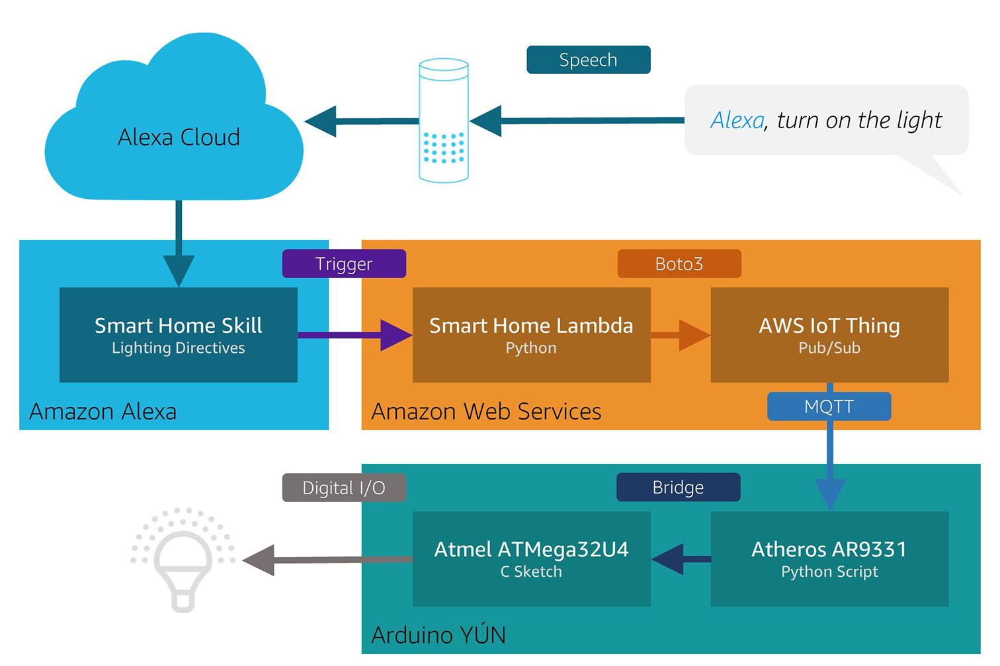

# Amazon Alexa / Arduino YÚN Smart Home Light Sample
This sample uses an Arduino YÚN with an Alexa Smart Home Skill to provide voice control to LED lights. The sample also implements an Amazon Web Services (AWS) IoT thing to represent the state of the light and MQTT to communicate that state with the Arduino YÚN. On the Arduino YÚN, a Python client listens for state changes and communicates those to a running sketch via the Bridge. The sketch uses the [Adafruit NeoPixel Library](https://github.com/adafruit/Adafruit_NeoPixel) to control LED lights in various colors and levels of brightness.

The sample implements the following Alexa Smart Home capabilities:
- Alexa.BrightnessController
- Alexa.ColorController
- Alexa.ColorTemperatureController
- Alexa.PowerController

## Getting Started
To get started, follow the [setup](docs/setup.md) guide.
