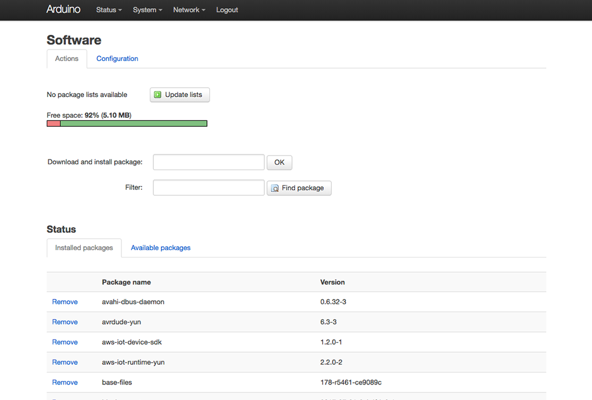

### Prepare and configure the Arduino YÚN device

This sample requires a current version of OpenSSL and TLS 1.2 to communicate securely with AWS. You will need to update the AR9331 System-on-a-Chip (SoC) firmware and image for the Linux platform.

Upgrading to the current release should elevate you to OpenSSL 1.0.2m or greater. You can verify your current OpenSSL version at the ash built-in shell with the following command:

```
openssl version
```

For this sample, I used YÚN 17.11 as the base firmware via this very useful forum post on the subject: https://forum.arduino.cc/index.php?topic=515869.0

If you have a current version of OpenSSL, you can proceed to install the required packages.

### Installing the required AWS IoT package

Either from the luci system user interface or _opkg_ on the command-line, install the AWS IoT Device SDK. As of the time of this tutorial, version 1.2.0-1 of the AWS IoT Device SDK for the Arduino YÚN was the latest.

#### From the command-line on the Arduino

1. Connect to the device via SSH and login as _root_.
2. Issue the following command.
```
opkg install aws-iot-device-sdk
```


#### From the luci System Management UI

1. In the luci System Management UI available at ```http://{YUN_IP_ADDRESS}/luci```, select System > Software from the top menu.
2. Either put ```aws-iot-device-sdk``` in the _Download and install package_ field or filter down using aws in the _Filter_ field.
3. Select the _Available Package_ tab and click **Install** to install the package.

When installed, the page will look like the following:





### Attach a compatible shield to the Arduino YÚN

Any Adafruit NeoPixel compatible LED lights should work. Refer to the instructions for your hardware to correctly attach or connect the lights to the Arduino YÚN. 

[Continue with the Setup](setup.md)