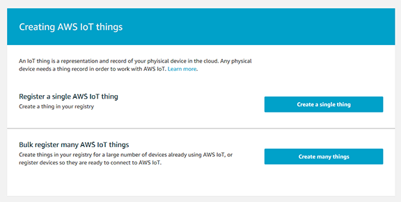
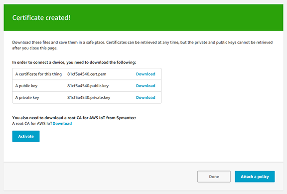

### Create an Amazon Web Services (AWS) IoT Thing


### Open the AWS IoT Console
Browse to [https://console.aws.amazon.com/iot/home](https://console.aws.amazon.com/iot/home). 

> You will want to make sure you sure you are in the us-east-1 region as this is the currently supported region for Alexa skills.

### Create a Thing
1. From the left menu, select **Manage** and the sub-menu **Things**.
2. In the _Things_ section, in the top right corner of the page select the **Create** button.
3. From the _Creating AWS IoT things_ dialog, we want to register a single AWS IoT thing so click the **Create a single thing** button.

    
    
4. From the _Add your device to the thing registry_ dialog, set the name to ```arduino-sample```.
5. Click **Next**.
6. From the _Add a certificate for your thing_ dialog, use the recommended option of creating a one-click certificate and click the **Create certificate**.
7. After the certificates are created, download each of the three provided certificates. The certificate for this thing and a public key and private key.

    

8. On the same dialog, also download the provided **root CA for AWS IoT from Symantec**. This file will be named _VeriSign-Class%203-Public-Primary-Certification-Authority-G5.pem_ or similar. Save this file as ```aws-iot-rootCA.crt```.

> Keep these files handy as these will be copied to the Arduino YÚN device. 

9. Click **Done**.

10. After the Thing is created, select it and select **Interact** from the left menu.
11. In the HTTPS section, save the **REST API endpoint**. It will look like ```XXXXXXXXXXXXXX.iot.us-east-1.amazonaws.com```. This value will be used in the MQTT client configuration.
 
 [Continue with the Setup](setup.md)
